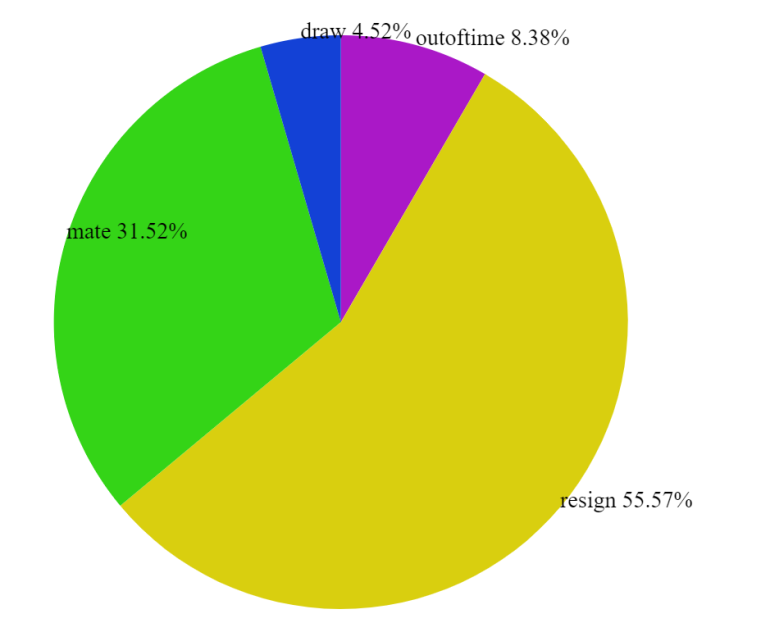
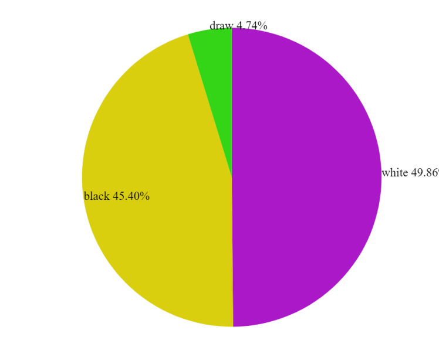

## Game of Chess  

                                             Introduction

Using the lichess dataset we plan to create a dropdown function to sort by different aspects of data. Some aspects that we plan to use are the player rating(how good a player is), opening moves(what standard chess openings were played), win type(checkmate, resign, timeout), and game result(white win, black win, draw). 

The user will be able to interact with these different identifiers to find out more about how the games are influenced by these factors. For example: the user could use our tool to figure out how player rating impacts the win type or frequency of different openings. Most of our data will be visualized in bar charts or pie charts that are able to demonstrate differences in the data. 

We will be using dynamic query for our project. The reason for our choice of dynamic query is that we believe it will facilitate the user in searching for their topics of interest. We also plan to use bar charts and pie charts interchangeably to fit the data that is being shown. For some, for example player rating, bar charts would be easier to interpret data like the average rating of all players. For others, like player vs player win data, it would be easier to see a pie chart for a ratio between two players.

                                           Problem and Motivations

The motivation for our project was our interest in chess, and how different factors would impact the outcome of online chess matches. We wanted to take into consideration things like rating, white vs. black, number of moves, game time, and how it relates to the outcome of the game. This is worth addressing because it can give some insight into one of the most popular strategy games of all time.

                                           Definitions
                                           
Turns: How many turns the game took to resolve

Victory Status: What caused the game to end (out of time, resign, checkmate, draw)

Rating: A player's matchmaking rank for online chess. Higher rating typically means the player's skill is higher. For Lichess, the average player is at around 1500 rating.

Average Rating: The average rating of the 2 players on white and black

Moves: The moves that occurred during the entire game’s playtime

                                             Visualizations
                                             
              
              
**Game Outcomes**

Minimum Average Rating:

<input type="text" id="minRating1" name="minRating1"/>

Maximum Average Rating:

<input type="text" id="maxRating1" name="maxRating1"/>

Minimum Turns:

<input type="text" id="minTurns1" name="minTurns1"/>

Maximum Turns:

<input type="text" id="maxTurns1" name="maxTurns1"/>

**Winning Side**

Minimum Average Rating:

<input type="text" id="minRating2" name="minRating2"/>

Maximum Average Rating:

<input type="text" id="maxRating2" name="maxRating2"/>

Minimum Turns:

<input type="text" id="minTurns2" name="minTurns2"/>

Maximum Turns:

<input type="text" id="maxTurns2" name="maxTurns2"/>

                                              Group Roles
                                                                  
During our project the work has been split up this way so far:

John - Creating the filtering system

Peter - Working on the charts

Mudit - Creating the website

Isaac - Interpreting data and creating writeups

                                                                  
                                               Challenges
                                               
Some of the challenges that we had to overcome during the process of creating our project were:
Interpreting vague or obscure data from the csv file.
Solving bugs in our interface
Working through scheduling differences during finals time.
                                                                  
                                                                  
                                                                  
                                                                  
                                                                  
