## Game of Chess  

                                             Introduction

A brief description of your final interactive visualization application.

Our final interactive visualization was the website that we created that contains all of our work thus far. It contains an introduction, problems and motivations, and definitions parts at the beginning to introduce a reader to our project and the reasoning behind it. It also helps a user become familiar with chess information that we will be working with. It then contains our visualizations, some static and some interactive, that present some important information and findings from the work that we did. 

Using the lichess dataset we plan to create a dropdown function to sort by different aspects of data. Some aspects that we plan to use are the player rating(how good a player is), opening moves(what standard chess openings were played), win type(checkmate, resign, timeout), and game result(white win, black win, draw). 

The user will be able to interact with these different identifiers to find out more about how the games are influenced by these factors. For example: the user could use our tool to figure out how player rating impacts the win type or frequency of different openings. Most of our data will be visualized in bar charts or pie charts that are able to demonstrate differences in the data. 

We will be using dynamic query for our project. The reason for our choice of dynamic query is that we believe it will facilitate the user in searching for their topics of interest. We also plan to use bar charts and pie charts interchangeably to fit the data that is being shown. For some, for example player rating, bar charts would be easier to interpret data like the average rating of all players. For others, like player vs player win data, it would be easier to see a pie chart for a ratio between two players.

              An explanation of changes between the storyboard and the final implementation

At the beginning of the project, our idea was to use dynamic query and the lichess dataset in order to allow our users to sort by different factors. These factors would then influence the graphs that were presented to them. This would allow for many interesting insights about the game of online chess. As we neared the deadline, it became clear that this goal was unobtainable, and we decided to switch directions. The changes that we decided to make were to use some static visualizations instead of all interactive ones, so that we could showcase some of the important findings that we had. We also decided to implement some interactive visualizations on tableau, and find a way to integrate that with our website.
	

                                           Motivations

The motivation for our project was our interest in chess, and how different factors would impact the outcome of online chess matches. We wanted to take into consideration things like rating, white vs. black, number of moves, game time, and how it relates to the outcome of the game. This is worth addressing because it can give some insight into one of the most popular strategy games of all time. Some of the things that we can learn from this project include the average number of moves for a game at different skill levels, how often a game ends a certain way, how likely a win is in a certain openings, and which openings are better at which skill levels. These things could potentially be implemented into one's own online chess gameplay to provide some strategy.

                                        CHALLENGES
					
* Interpreting vague or obscure data from the csv file. There were some data columns in the csv file that had very difficult to read formatting, and we had to do a bit of digging in order to understand what they meant. 
* Solving bugs in our interface. We had troubles working with different interaction pieces in our code, and making it work correctly when uploaded and implemented into our website.
* Working through scheduling differences during finals time. Often times one or more members of our group would struggle to make it to meetings as a result of finals scheduling or other time conflicts. 
* Overestimating our ability and speed of completing work. Originally, we tried to do much more than we ended up being capable of doing, so we had to cut back a little bit and work on a project that was more reasonable and within our abilities.

                                           Definitions
                                           
Turns: How many turns the game took to resolve

Victory Status: What caused the game to end (out of time, resign, checkmate, draw)

Rating: A player's matchmaking rank for online chess. Higher rating typically means the player's skill is higher. For Lichess, the average player is at around 1500 rating.

Average Rating: The average rating of the 2 players on white and black

Moves: The moves that occurred during the entire game’s playtime

                                   
				   Interactive Visualizations
				   
<iframe seamless frameborder="0" src="https://public.tableau.com/app/profile/peter8439/viz/a_16398946906600/Sheet1" width = '650' height = '450' scrolling='yes' ></iframe>

<object class='tableauViz'  style='display:none;'><param name='host_url' value='https%3A%2F%2Fpublic.tableau.com%2F' /> <param name='embed_code_version' value='3' /> <param name='site_root' value='' /><param name='name' value='a_16398946906600&#47;Sheet1' /><param name='tabs' value='no' /><param name='toolbar' value='yes' /><param name='animate_transition' value='yes' /><param name='display_static_image' value='yes' /><param name='display_spinner' value='yes' /><param name='display_overlay' value='yes' /><param name='display_count' value='yes' /><param name='language' value='en-US' /></object>
                

                                             Visualizations
 
Average Game Length - This graph shows the average number of moves for a game at 4 different skill levels. As we can see, there is a positive correlation between skill and longer game length. 
 
Game length by the opening with variation - This graph shows some different openings and how the many moves the resulting games take on average. It shows that opening can impact game length quite heavily.
 
Missing Title - This graph shows how often a game ends a certain way. It shows that most games end by resignation of one player, and very few games end in a draw. 
 
Victorious Color - This graph shows the outcome of games at different skill levels. An interesting takeaway is that white has a distinct advantage at all levels, and that draws are much more likely at the pro level.
 
Victory Status by the Game Rating - This graph shows how likely a certain a game ending is a different skill levels. It shows that checkmate is relatively unlikely at pro level relative to other levels of play.

Win by Opening and Level - These two graphs show how likely a win is in a certain openings, filtered by skill levels. It shows that some opening are better at different skill levels. 

Winner by the Opening with Variation in % - This graph shows the likelihood of an outcome for different openings. With this graph you can see which openings are better for which color, and which result in more draws. 

Winner by Opening and Level - These two graphs show the likelihood of an outcome for different openings. With these graphs you can see which openings are better for which color, and which result in more draws.

                        
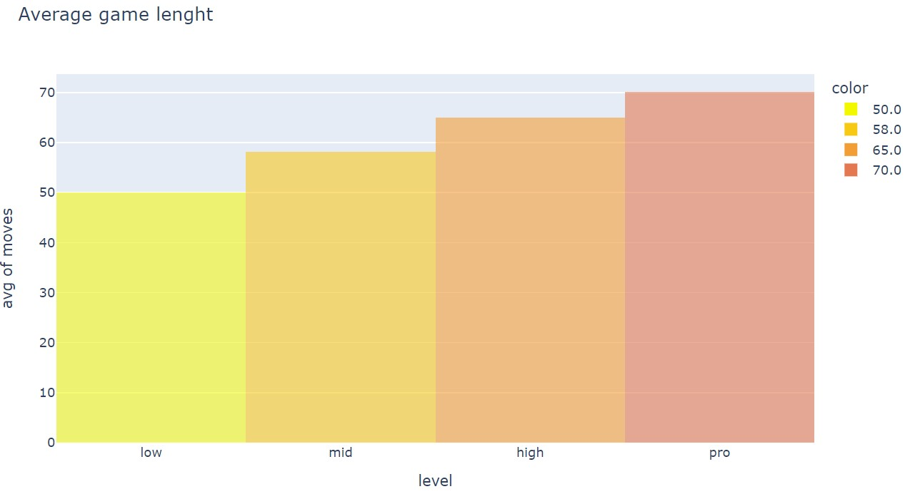

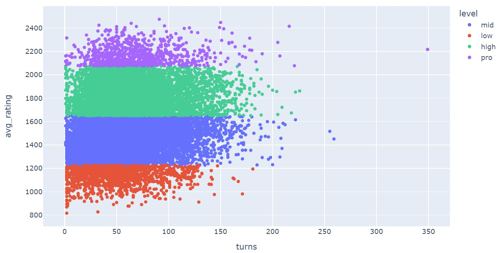

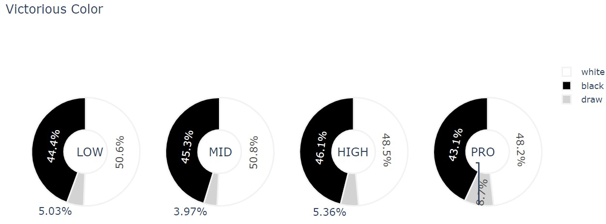

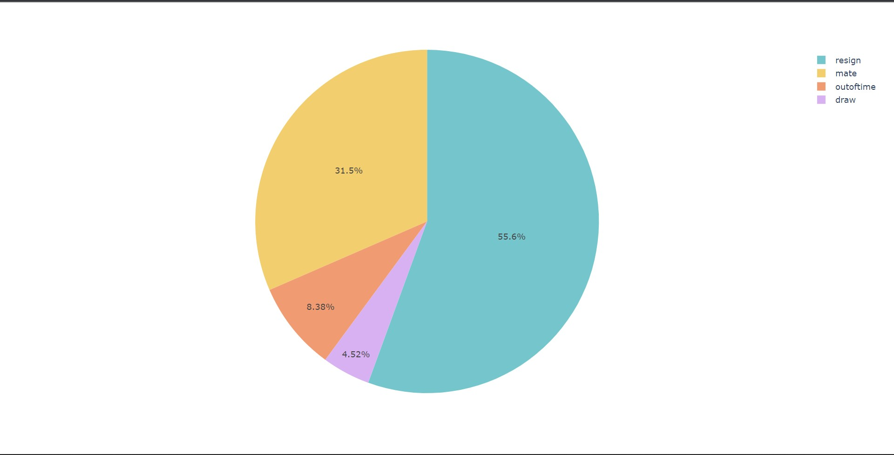

 

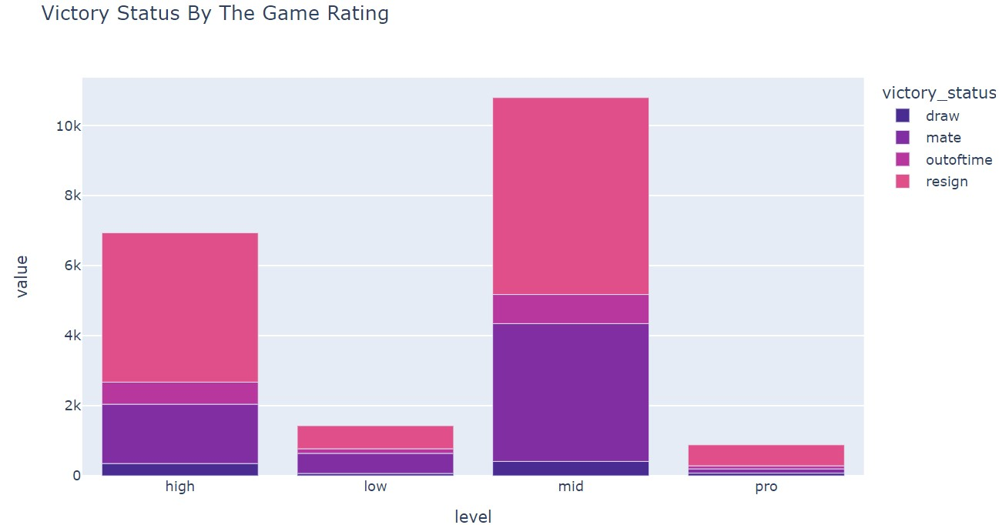

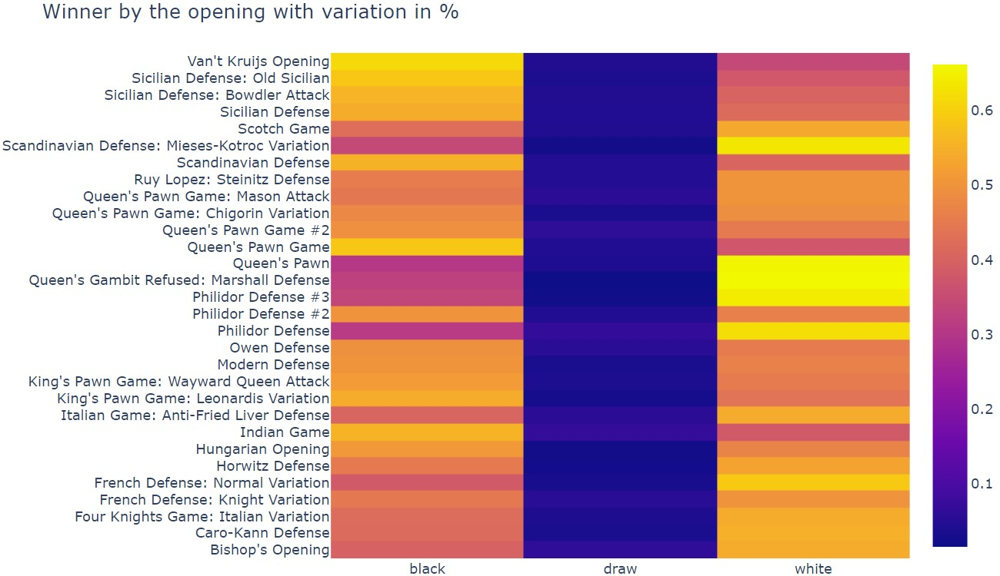

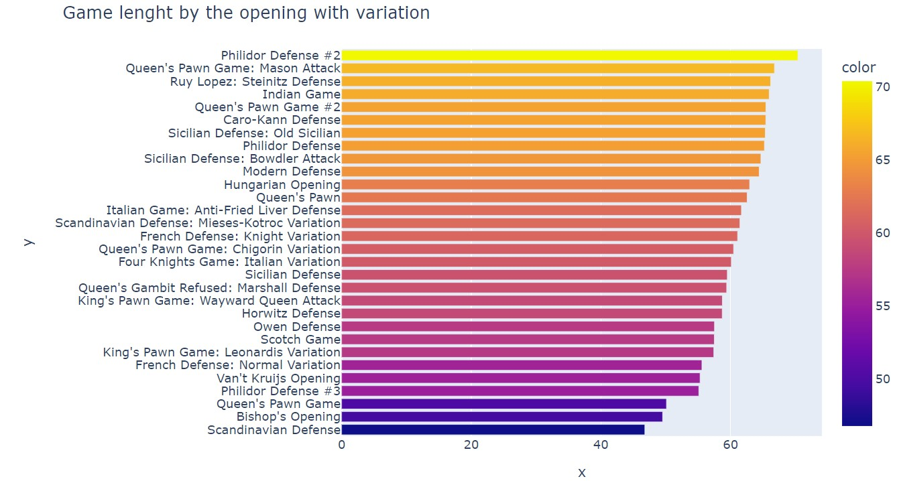

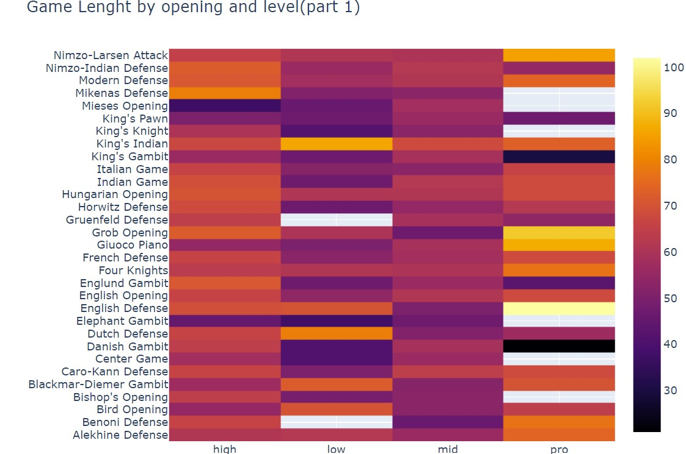

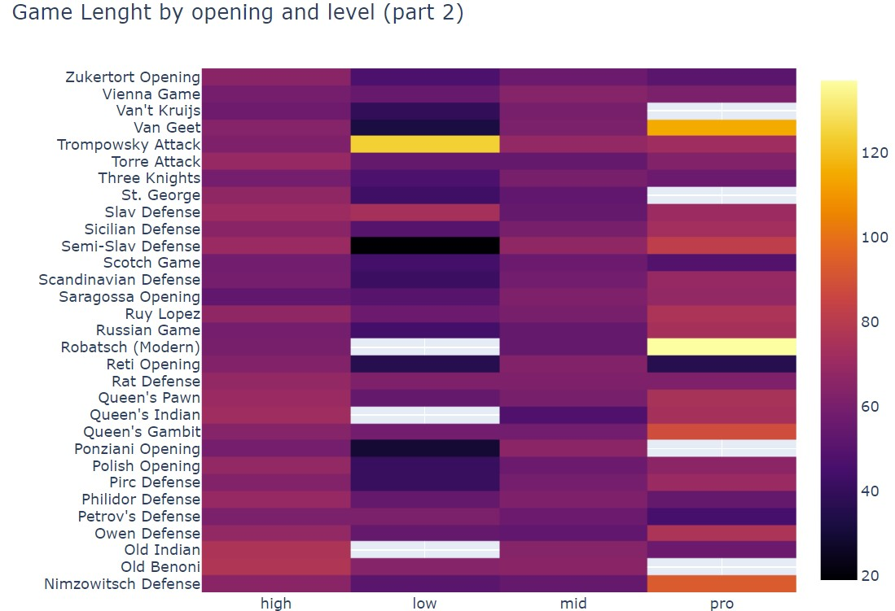

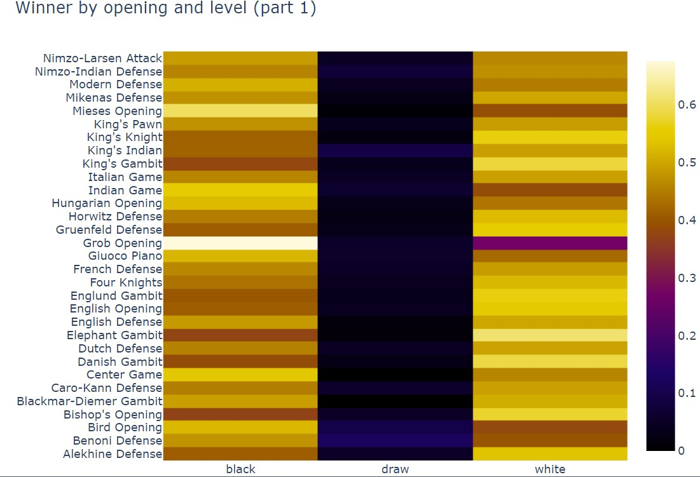

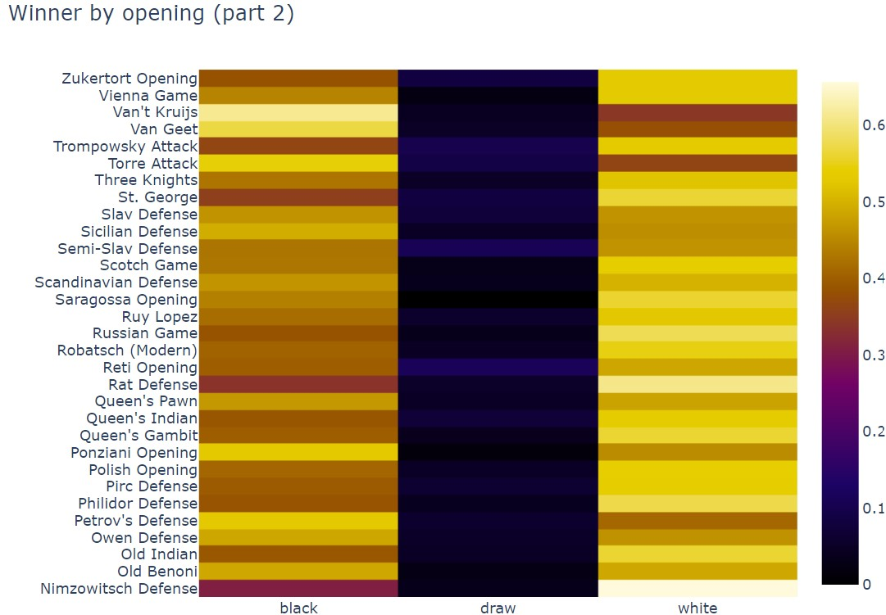

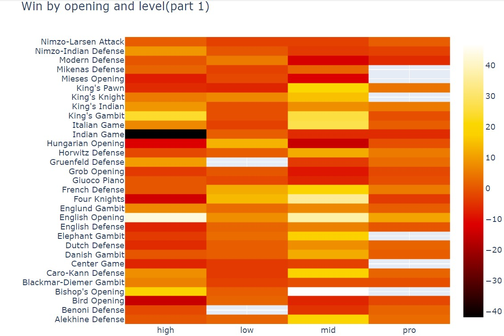

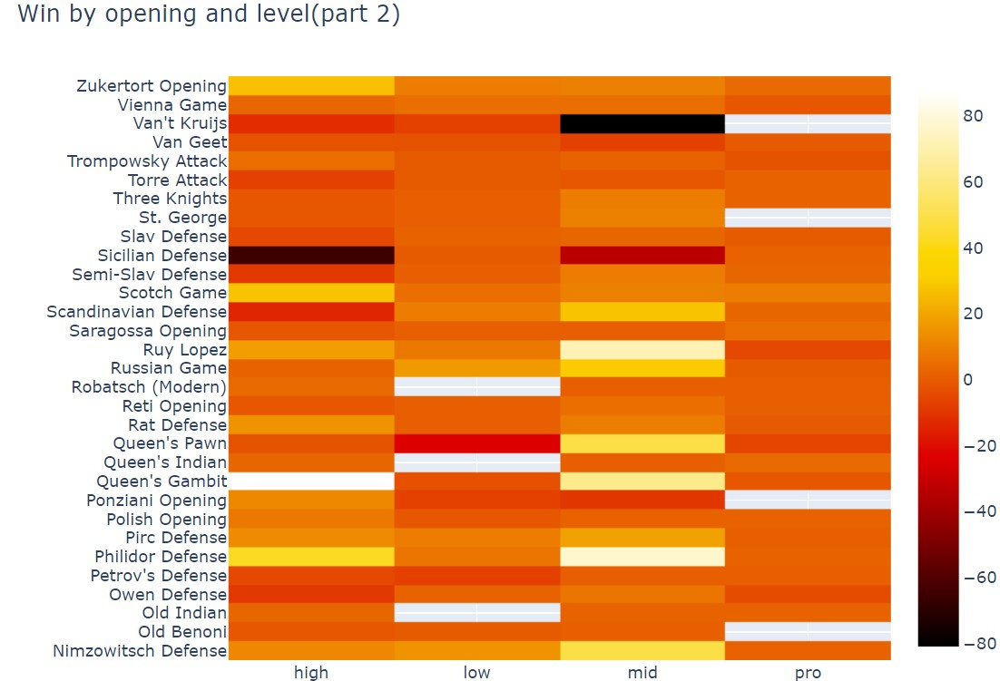

                    Some Interesting Facts learned through these Visualizations
		    
* The average game lenght is 60 turns
* The higher the rating of the players the game last longer ( linear dependence )
* The game lasts the longest with Robatsh (modern) Defense and English Defense
* The game lasts the shortest with Semi-Slav Defense and Danish Gambit
* The game of chess doesn't usually last more than 100 moves

* White color is slightly more likely to win, but when the rating is high draws occurs more often
* Best win rate for white has Nimzowitsh Defense, Rat Defense and Elephant Gambit
* Best win rate for black has Grob Opening and Van't Krujis Opening
* For the mid ranked players best win rate for white has Philidor Defense, although for black Van't Krujis Opening
* For the high ranked players best win rate for white has English Opening and Indian Game for black
* For the pro players white has best win rate with English Opening, black although with Modern Defense

* The most popular opening is Opening and Sicilian Defense and Van't Kruijs Opening

* Higher rated players usually resign more often
* The average amount of book moves in opening plays is : 5

          
 

                                              Group Roles
                                                                  
During our project the work has been split up this way so far:

* John - Creating the filtering system: John worked on the coding in D3 to take what Peter created and make it function the way that we wanted for the website.
* Peter - Working on the bar charts: Peter worked with the data provided in the csv file in order to create many different charts that we could use for our final product.
* Mudit - Creating the website: Mudit took those two pieces and used them to create the user end website that people can interact with.
* Isaac - Interpreting data and creating writeups: Isaac helped with interpreting and researching aspects of the data, and creating the writeups and scripts. 

                                                                                                                                 
                                                                  
                                                                  
                                                                  
